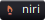

  
  
  
  
  
  
  
 

  <b>Welcome to my profile!</b>

I like self-hosting and privsec stuff. I'm especially interested in sandboxing technologies and secure computation. 

## Projects

| Project | Notes |
|---|---|
| [Rufin](https://github.com/screwys/Rufin)    | Native GTK4 music client for Jellyfin, Subsonic, Navidrome and local libraries |
| [Igloo](https://github.com/screwys/Igloo)    | Self-hosted social inbox for YouTube, X, Instagram and TikTok |
| [nocblue](https://github.com/screwys/nocblue)     | Custom Fedora Silverblue image I'm daily-driving, based on [secureblue](https://github.com/secureblue/secureblue) with packages I want on top |
| [agent-sandbox](https://github.com/screwys/agent-sandbox)  | Sandbox tool for CLI agents and Codex Desktop |

## Tools

| Tool | Notes |
|---|---|
| [rescue](https://github.com/screwys/rescue)  | Cross-platform LAN server to drop text/scripts between devices |
| [freebsd-scripts](https://github.com/screwys/freebsd-scripts)    | Installation script for FreeBSD |
